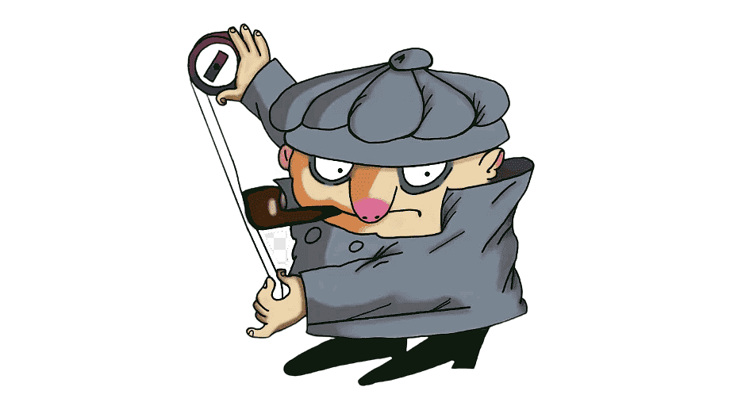

# UnityBrotherPilot

## Данный проект представляет из себя перенос на движок Unity квеста братьев Пилотов реализованного ранее с помощью Windows Forms (https://github.com/VladislavChepusov/brothers_pilots)

   

## Об игре
1. На сейфе множество поворачиваемых рукояток, которые могут быть расположены горизонтально или вертикально. 
Рукоятки расположены квадратом, как 2-мерный массив NxN. 
2. Сейф открывается, только если удается расположить все ручки параллельно друг другу (т.е. все вертикально или все горизонтально). 
3. В разделе настроек можно задать размерность матрицы.
4. По нажатия на ESC можно выйти в меню.

## Пример:

   

